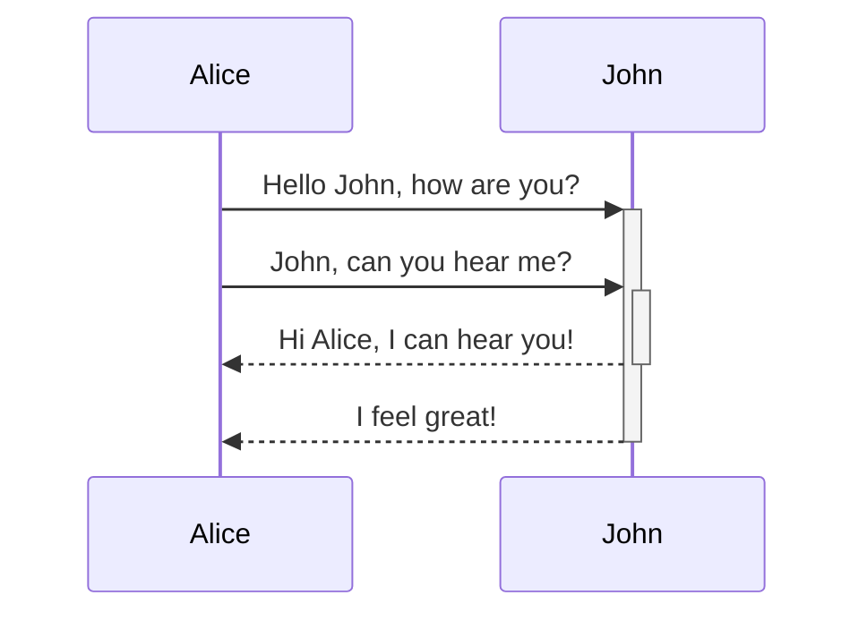
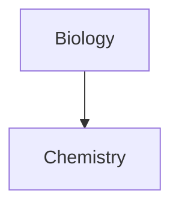
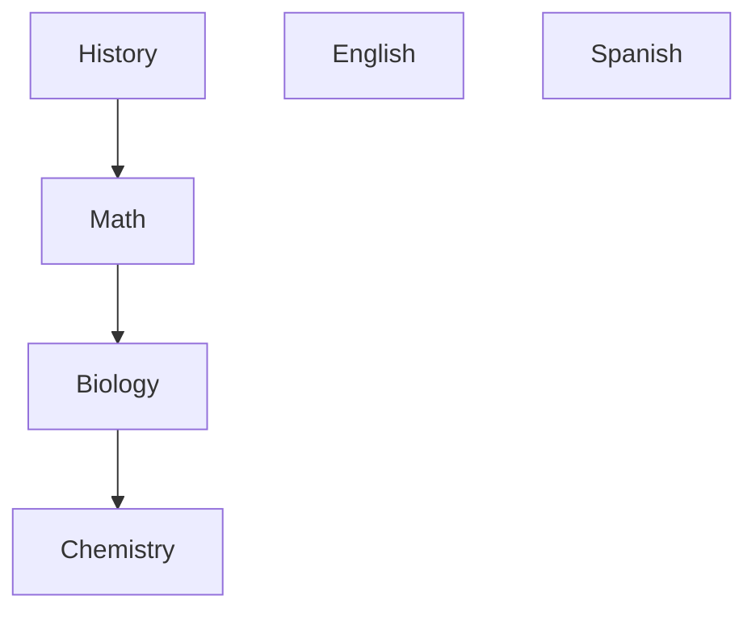

This is an area used for testing different formats to be used in obsidian
## Diagrams

>[!Tip]
>You can also try Mermaid's [Live Editor](https://mermaid-js.github.io/mermaid-live-editor) to help you build diagrams before you include them in your notes.

### Diagrams with links

### Diagrams with many nodes + links

